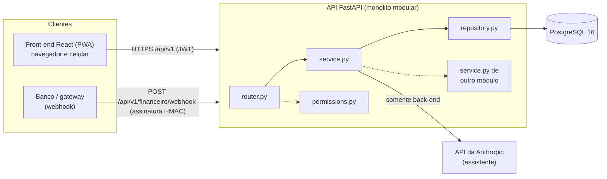
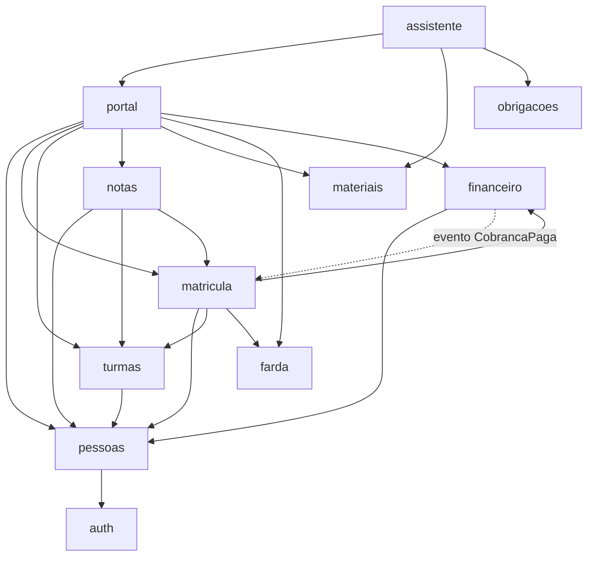

# Arquitetura do Semeando

Este documento define os padrões que **todo mundo** segue no projeto. Se você discorda de uma
regra, abra um PR alterando este arquivo e explique o motivo. Não quebre a regra em silêncio.

Várias regras daqui são verificadas automaticamente por `backend/tests/test_architecture.py`
e `backend/tests/test_migrations.py`. Se esses testes falharem, o CI bloqueia o PR.

---

## 1. Visão geral: monolito modular

O back-end é **um único serviço FastAPI** (um deploy, um banco), dividido em **módulos de
negócio independentes** com a mesma estrutura interna. Escolhemos esse modelo porque:

- Um time pequeno não paga o custo operacional de microsserviços (rede, deploy, observabilidade).
- Os limites entre módulos são explícitos. Se um dia algum módulo precisar virar serviço
  separado, a fronteira já está desenhada (ele só conversa via `service` público).
- Uma transação de banco pode envolver vários módulos, como aprovar uma matrícula, que ocupa
  a vaga, gera a cobrança e muda o status, tudo atômico.



**Regras inegociáveis**

1. **Toda regra de negócio, validação, permissão e checagem de propriedade fica no back-end.**
   O front-end pode esconder botões e validar formulários para ajudar o usuário, mas parta do
   princípio de que qualquer pessoa chama a API direto (curl/Postman/DevTools).
2. **O front-end nunca acessa o banco** (nada de Supabase/Firebase/BaaS). Tudo passa pela API.
3. **Fluxo obrigatório: `router → service → repository → banco`.**
4. **Nenhum arquivo de código entra sem teste** (verificado por `test_every_code_file_has_a_test_file`).

---

## 2. Estrutura de pastas

```
backend/
├── app/
│   ├── main.py            # cria o app e registra os routers
│   ├── all_models.py      # importa os models de todos os módulos (Alembic/testes)
│   ├── core/              # infraestrutura: config, database, security, deps, exceptions,
│   │                      # audit, rate_limit, events, roles
│   ├── shared/            # utilitários de domínio sem estado: cpf, serie, state_machine,
│   │                      # pagination, schemas base, clock
│   └── modules/<modulo>/  # um diretório por módulo de negócio
├── alembic/versions/      # migrations
├── tests/                 # espelha app/: tests/modules/<modulo>/test_<arquivo>.py
└── scripts/seed.py        # dados de demonstração
```

`core/` e `shared/` **nunca** importam `app.modules.*` (teste `test_core_and_shared_do_not_depend_on_modules`).

---

## 3. Anatomia de um módulo

Todo módulo tem **sempre** estes arquivos (teste `test_every_module_has_the_standard_files`):

| Arquivo | Responsabilidade | Pode importar |
|---|---|---|
| `models.py` | Entidades SQLAlchemy 2.0 (`Mapped[...]`, `mapped_column`). | `core.database`, `shared` |
| `schemas.py` | Pydantic de entrada (`InputSchema`) e saída (`OutputSchema`). **Nunca devolva um model direto na API.** | `shared` |
| `repository.py` | **Única** camada que monta queries. Não faz `commit` (só `add`/`flush`). | `models` do próprio módulo |
| `service.py` | Regras de negócio e casos de uso. **Não conhece HTTP** (não importa FastAPI). Levanta exceções de `core.exceptions`. | `repository`, `schemas`, `permissions`, `service`/`schemas` de outros módulos |
| `router.py` | Endpoints finos: recebem a requisição, aplicam `Depends(require_roles(...))`, chamam o service e devolvem schemas. Sem regra de negócio e sem acesso a repository/models. | `service`, `schemas`, `permissions`, `core.deps` |
| `permissions.py` | Quem pode fazer o quê no módulo (tuplas de perfis) e checagens de propriedade reutilizáveis. | `core.roles` |

Módulos podem ter arquivos extras quando há um motivo claro, por exemplo `financeiro/gateway.py`
(integração com o banco) e `assistente/llm.py` (cliente do LLM). Arquivo extra também precisa de teste.

Módulos agregadores sem tabelas próprias (ex.: `portal`) mantêm `models.py` e `repository.py`
apenas com um docstring explicando isso.

### Módulos

| Módulo | Responsabilidade |
|---|---|
| `auth` | Usuários, login, refresh token, logout. |
| `pessoas` | Alunos, responsáveis (vínculo N:N com parentesco), professores e funcionários. |
| `turmas` | Turmas (série + ano letivo + turno), capacidade e vagas, professores da turma. |
| `matricula` | Pré-matrícula, matrícula nova × rematrícula, aprovação/rejeição, documentos. |
| `farda` | Estoque de farda por item/tamanho e reservas atômicas. |
| `materiais` | Lista de materiais por série e links de livros. |
| `financeiro` | Cobranças, bolsas, preços, gateway de pagamento e política de inadimplência. |
| `notas` | Boletim simples (disciplina × bimestre) lançado pelo professor da turma. |
| `portal` | Visão agregada do responsável sobre os filhos (sem tabelas próprias). |
| `obrigacoes` | Calendário de obrigações legais/administrativas da escola. |
| `assistente` | Chat com IA, com ferramentas somente leitura executadas com as permissões do usuário. |

### Dependências permitidas entre módulos

Um módulo só pode importar **`service` e `schemas`** de outro módulo
(teste `test_modules_only_use_service_or_schemas_of_other_modules`), e o grafo **não pode ter
ciclos** (teste `test_module_dependency_graph_is_acyclic`).



Quando um módulo precisa *reagir* a algo de um módulo do qual ele não pode depender (porque
criaria ciclo), use **eventos de domínio** (`app/core/events.py`). Exemplo: o `financeiro`
publica `CobrancaPaga`; o `matricula` (que já depende do financeiro) se inscreve no evento e
ativa a matrícula. O handler roda na mesma transação de quem publicou.

**Os dados que cruzam fronteiras de módulo são schemas (`*Read`), nunca models do SQLAlchemy.**
No banco, foreign keys entre tabelas de módulos diferentes são permitidas (integridade
referencial), mas não use `relationship()` atravessando módulos.

---

## 4. Padrão de nomes e idioma

**Regra: domínio em português, mecânica em inglês.**

| O quê | Idioma | Exemplos |
|---|---|---|
| Substantivos do domínio escolar: entidades, campos, tabelas, enums de domínio, rotas e campos JSON da API, nomes de módulos | **Português**, sem acento, `snake_case` (classes em `PascalCase`) | `Aluno`, `Matricula`, `Cobranca`, `responsavel_financeiro`, `quantidade_reservada`, `StatusMatricula.EM_ANALISE`, `/api/v1/matriculas/{matricula_id}/aprovar` |
| Mecânica de software: camadas, verbos dos métodos, sufixos técnicos, infraestrutura, exceções, nomes de testes | **Inglês** | `repository`, `service`, `create_aluno`, `approve_matricula`, `AlunoCreate`, `AlunoRead`, `require_roles`, `NotFoundError`, `test_approve_without_vaga_returns_409` |
| Textos para o usuário (mensagens de erro, labels, documentação) | **Português do Brasil** | `"Turma sem vagas disponíveis."` |
| Códigos de erro (`code`) | Genéricos em inglês, específicos de domínio em português | `NOT_FOUND`, `FORBIDDEN`, `VAGA_INDISPONIVEL`, `BLOQUEIO_INADIMPLENCIA` |

- Funções e métodos: **verbo em inglês + substantivo do domínio** (`list_cobrancas_pendentes`,
  `reserve_farda`, `grant_bolsa`).
- Nomes que aparecem para o LLM (ferramentas do assistente) ficam em português, porque fazem
  parte do "texto" que o modelo lê: `status_matricula_dos_meus_filhos`.
- Constantes: `UPPER_SNAKE_CASE`. Arquivos e pastas: `snake_case`.
- Front-end: componentes em `PascalCase` (`MatriculaForm.tsx`), hooks `useXxx`, mesma regra de idioma.

Glossário de termos do domínio usados no código:
`aluno`, `responsavel`, `parentesco`, `professor`, `funcionario`, `turma`, `serie`, `segmento`,
`turno`, `ano_letivo`, `matricula`, `rematricula`, `pre_matricula`, `farda`, `estoque`,
`reserva`, `material`, `livro`, `cobranca`, `mensalidade`, `taxa_associado`, `bolsa`,
`inadimplencia`, `boleto`, `linha_digitavel`, `nota`, `disciplina`, `bimestre`, `boletim`,
`obrigacao`, `ocorrencia`, `vaga`.

---

## 5. Padrão de erros

Toda resposta de erro tem o formato:

```json
{ "detail": "Mensagem legível em português.", "code": "CODIGO_MAQUINA" }
```

Erros de validação (422) incluem também `errors: [{loc, msg, type}]`.

O service **levanta exceções de `app/core/exceptions.py`** e os handlers as convertem em HTTP:

| Exceção | HTTP | Quando usar |
|---|---|---|
| `UnauthorizedError` | 401 | Sem token / token inválido ou expirado |
| `ForbiddenError` | 403 | Perfil sem permissão para a ação |
| `NotFoundError` | 404 | Recurso não existe **ou pertence a outra família** (ver §6) |
| `ConflictError` | 409 | Conflito com o estado atual (duplicidade, sem vaga) |
| `InvalidTransitionError` | 409 | Transição de status proibida pela máquina de estados |
| `BusinessRuleError` | 422 | Regra de negócio violada com dados válidos |
| `RateLimitError` | 429 | Limite de requisições estourado |

Nunca devolva stack trace nem mensagem interna (o handler genérico responde `INTERNAL_ERROR`).

---

## 6. Autenticação, permissões e propriedade de dados

- **Login** (`POST /api/v1/auth/login`) devolve um *access token* JWT curto (15 min) no corpo
  e o *refresh token* (7 dias) em **cookie httpOnly** `SameSite=Strict` (e também no corpo, para
  clientes não-navegador como um futuro app nativo). Refresh tokens são rotacionados a cada uso
  e ficam registrados no banco, o que permite revogá-los (logout, desativação de usuário).
- O front guarda o access token **só em memória**.
- Senhas: **Argon2** (`argon2-cffi`). Nunca logue senha ou token.
- **RBAC**: perfis `ADMIN` (direção), `SECRETARIA`, `FINANCEIRO`, `PROFESSOR`, `RESPONSAVEL`.
  A checagem de perfil é feita no router com `Depends(require_roles(...))`, usando as tuplas
  definidas no `permissions.py` do módulo:

  ```python
  # matricula/permissions.py
  CAN_APPROVE = (Role.ADMIN, Role.SECRETARIA)

  # matricula/router.py
  @router.post("/{matricula_id}/aprovar")
  def approve(matricula_id: int, payload: AprovarMatricula, db: DbSession,
              user: CurrentUser = Depends(require_roles(*permissions.CAN_APPROVE))) -> MatriculaRead:
      return service.approve_matricula(db, matricula_id, payload, user)
  ```

- **Propriedade (anti-IDOR)**: um `RESPONSAVEL` só acessa alunos aos quais está vinculado.
  **Toda** função de service que recebe `aluno_id`, `matricula_id`, `cobranca_id` etc. em nome
  de um responsável chama a checagem de vínculo (`pessoas_service.ensure_can_access_aluno`).
  Se o recurso é de outra família, a resposta é **404** (não revelamos que o ID existe).
  Perfil errado → **403**.
- **Campos sensíveis nunca vêm do cliente**: `status`, `valor`, `desconto`, `role`,
  `responsavel_id`, `pago` são definidos pelo back-end. Os schemas de entrada herdam de
  `InputSchema` (`extra="forbid"`), então enviar esses campos resulta em **422**.
- **Transições de status** passam sempre por uma `StateMachine` (`app/shared/state_machine.py`).
  Transição inválida → **409**.
- **Rate limit** no login, no cadastro público e no assistente (`app/core/rate_limit.py`, em
  memória; com mais de um processo, trocar por Redis).
- **CORS** restrito às origens de `CORS_ORIGINS`.
- **LGPD**: os dados são de menores. Colete só o necessário, mostre CPF **mascarado** em
  listagens (`shared/cpf.py: mask_cpf`), não exponha dados de uma família para outra e não
  mande dados pessoais ao LLM além do que o próprio usuário já pode ver.

---

## 7. Transações

- O **repository nunca faz `commit`** (teste `test_repository_never_commits`).
- O **service que implementa um caso de uso chamado pelo router** faz `db.commit()` no final.
- Funções de service **expostas para outros módulos** (ex.: `turmas_service.occupy_vaga`)
  **não fazem commit**: elas participam da transação de quem chamou. Isso vem escrito no
  docstring: *"Não faz commit: participa da transação de quem chamou."*
- Concorrência: quando duas requisições podem disputar o mesmo recurso (vaga na turma, estoque
  de farda), use **lock de linha** (`SELECT ... FOR UPDATE`, via `.with_for_update()`) ou um
  `UPDATE` condicional atômico, e escreva um teste de concorrência.

---

## 8. Auditoria

A tabela `audit_log` guarda quem, quando, ação, entidade e o estado antes/depois. É obrigatória
para: aprovar/rejeitar matrícula, conceder bolsa, baixar pagamento e alterar estoque.

```python
from app.core.audit import record_audit, snapshot

before = snapshot(matricula, ["status", "turma_id"])
...  # altera
record_audit(db, actor=user, action="matricula.aprovar", entity="matricula",
             entity_id=matricula.id, before=before, after=snapshot(matricula, ["status", "turma_id"]))
```

Ações seguem o padrão `<entidade>.<verbo>`. O ADMIN consulta em `GET /api/v1/auditoria`.

---

## 9. Migrations (Alembic)

- Todo model novo ou alterado precisa de migration. O teste `test_models_and_migrations_are_in_sync`
  falha se models e migrations divergirem.
- Gerar: `cd backend && uv run alembic revision --autogenerate -m "descricao curta" --rev-id 00NN`
  (numeração sequencial de 4 dígitos). **Revise o arquivo gerado** antes de commitar.
- Aplicar: `uv run alembic upgrade head`. Reverter uma: `uv run alembic downgrade -1`.
- Enums são gravados como `VARCHAR` (`native_enum=False`), o que facilita adicionar valores sem
  `ALTER TYPE`.
- Nunca edite uma migration que já está na `main`. Crie outra.
- Se duas branches criarem migrations em paralelo, o teste `test_migration_history_is_linear`
  acusa duas *heads*. Ajuste o `down_revision` da sua para apontar para a mais recente.

---

## 10. Testes

- Back-end: `pytest` contra **PostgreSQL real** (banco `semeando_test`). O schema é criado uma
  vez por sessão aplicando as migrations; **cada teste roda numa transação com rollback**
  (os `commit()` viram `SAVEPOINT`s).
- Estrutura espelhada: `app/modules/matricula/service.py` → `tests/modules/matricula/test_service.py`.
- O que testar em cada arquivo:
  - **service**: regras de negócio (unitário, com banco de teste).
  - **router**: integração via `TestClient`, cobrindo o caminho feliz, **401** sem token,
    **403** com perfil errado, **404** ao acessar filho de outra família e **422** com payload
    inválido ou campos sensíveis (`status`, `valor`, `role`) no corpo.
  - **repository**: queries contra o banco real.
  - **permissions**: a matriz de quem pode o quê.
- Fixtures úteis (`tests/conftest.py`, `tests/factories.py`): `db`, `client`, `headers_for(Role.X)`,
  e factories como `make_responsavel(db)`, `make_aluno(db, ...)`.
- Testes de concorrência (marcados com `@pytest.mark.concurrency`) usam conexões reais e
  limpam o que criaram.
- Cobertura mínima: **80% nos services** (o CI verifica).
- Front-end: Vitest + Testing Library nos formulários, guardas de rota e cliente da API.

Comandos:

```bash
cd backend
uv run pytest                      # todos os testes
uv run pytest tests/modules/matricula -k aprovar
uv run pytest --cov=app            # com cobertura
uv run ruff check . && uv run ruff format --check . && uv run mypy app tests
```

---

## 11. Como criar um módulo novo (passo a passo)

Use o módulo **`materiais`** como referência: é o mais simples e tem todos os arquivos.

1. Crie a branch: `git switch -c feat/<modulo>`.
2. Copie a pasta: `cp -r backend/app/modules/materiais backend/app/modules/<modulo>` e renomeie
   classes/funções.
3. `models.py`: defina as tabelas herdando de `Base` (e `TimestampMixin` se fizer sentido).
   Adicione `from app.modules.<modulo> import models` em `app/all_models.py`.
4. `schemas.py`: entradas herdam de `InputSchema`, saídas de `OutputSchema`. **Não** coloque
   campos sensíveis (status, valor, ids de dono) nas entradas.
5. `permissions.py`: declare as tuplas de perfis (`CAN_CREATE = (Role.ADMIN, ...)`).
6. `repository.py`: só queries; sem commit.
7. `service.py`: regras de negócio; `db.commit()` no fim dos casos de uso; checagem de
   propriedade quando houver dados de família.
8. `router.py`: `APIRouter(prefix="/api/v1/<modulo>", tags=["<modulo>"])`, endpoints finos.
   Registre o router em `ROUTERS` no `app/main.py`.
9. Gere a migration (§9).
10. Escreva os testes em `tests/modules/<modulo>/` (um `test_<arquivo>.py` por arquivo).
11. Documente em `docs/modulos/<modulo>.md` (use um dos existentes como modelo).
12. Rode `uv run pytest && uv run ruff check . && uv run mypy app tests` e abra o PR.

---

## 12. Branches e commits

- Branch principal: `main` (protegida, só entra via PR com CI verde e 1 review).
- Nome de branch: `<tipo>/<descricao-curta>`. Exemplos: `feat/matricula-upload`,
  `fix/vaga-concorrencia`, `docs/financeiro`.
- Commits no padrão **Conventional Commits**, em português:
  `feat(matricula): permitir upload de documentos`,
  `fix(financeiro): corrigir arredondamento da bolsa`,
  `test(turmas): cobrir limite de 30 alunos`, `docs: atualizar ARQUITETURA`.
  Tipos: `feat`, `fix`, `test`, `docs`, `refactor`, `chore`, `ci`.
- Detalhes do fluxo de PR e checklist em [`CONTRIBUINDO.md`](CONTRIBUINDO.md).
