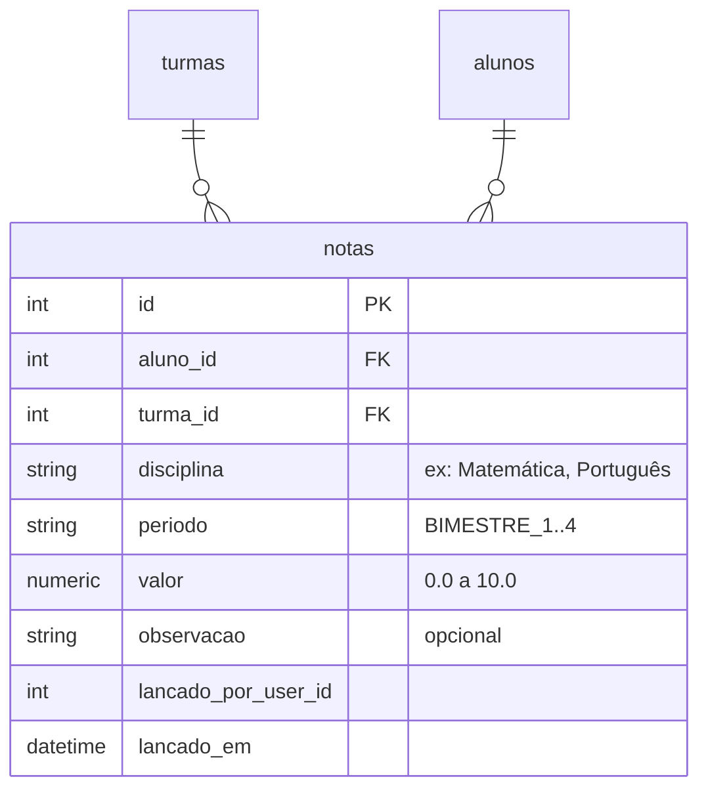
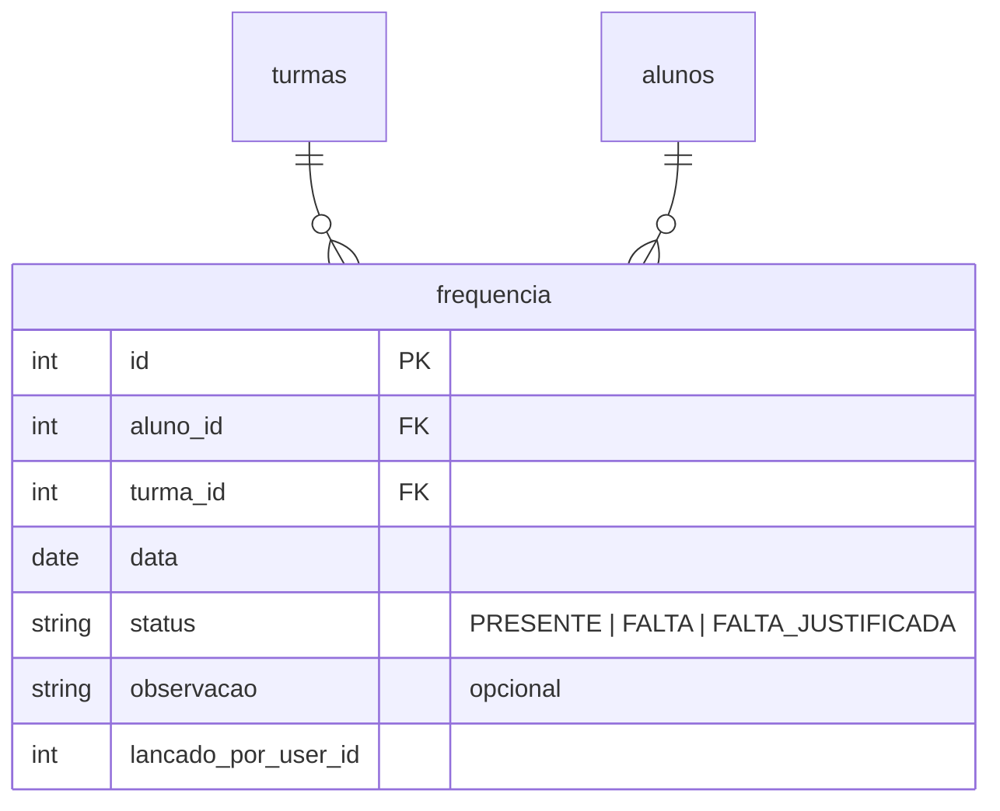
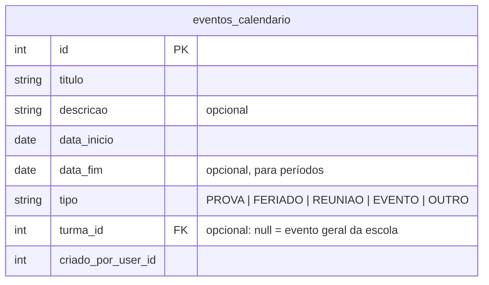
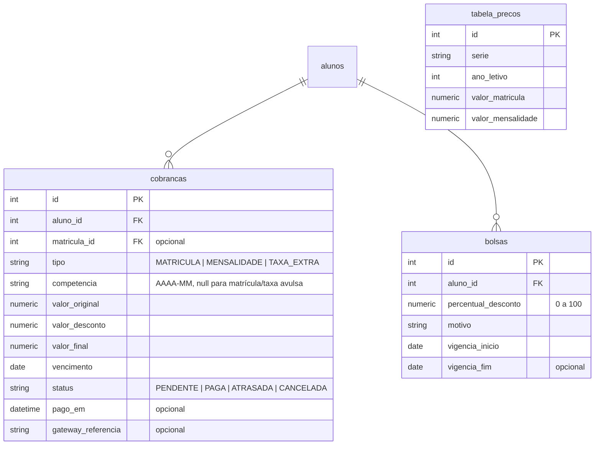
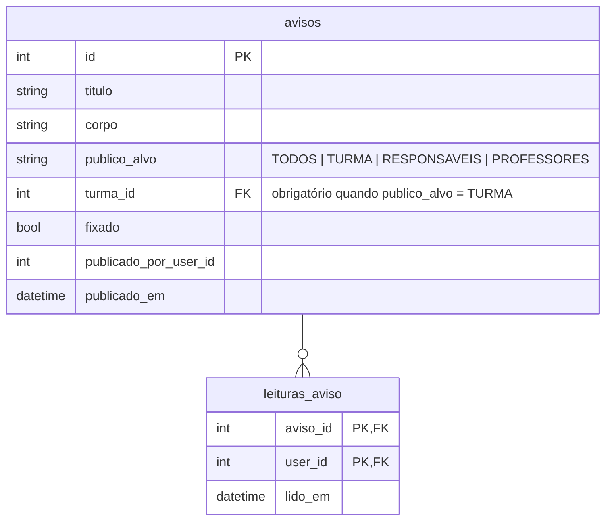
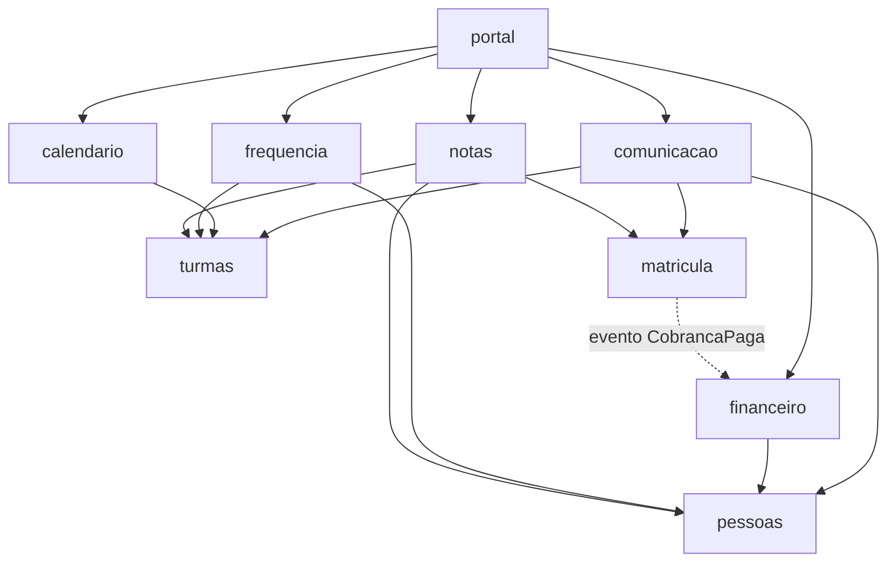

# Levantamento — Acadêmico, Financeiro e Comunicação

Este documento mapeia o que falta construir para os três módulos pedidos. Segue a mesma
convenção dos módulos já implementados (`docs/modulos/auth.md`, `docs/modulos/pessoas.md`) e
do `docs/ARQUITETURA.md` — nada aqui está implementado ainda, é o levantamento antes de codar.

`notas` e `financeiro` já apareciam no grafo de dependências do `ARQUITETURA.md`; `frequencia`,
`calendario` e `comunicacao` são novos e precisam ser adicionados lá quando entrarem em
desenvolvimento.

---

## 1. Acadêmico

Divido em 3 módulos pequenos (`notas`, `frequencia`, `calendario`) em vez de um módulo
"acadêmico" genérico, seguindo a regra do projeto de módulos pequenos e independentes.

### 1.1 `notas` — boletim

**Objetivo:** professor lança notas por disciplina/período; secretaria e responsável consultam
o boletim consolidado.

| Método | Rota | Perfis | Descrição |
|---|---|---|---|
| `GET` | `/notas/turmas/{turma_id}?periodo=` | PROFESSOR **da turma**, SECRETARIA, ADMIN | Grade de lançamento: todos os alunos × disciplinas da turma |
| `PUT` | `/notas/turmas/{turma_id}/alunos/{aluno_id}` | idem | Lança/atualiza uma nota (upsert por aluno+disciplina+período) |
| `GET` | `/notas/alunos/{aluno_id}/boletim` | equipe; RESPONSAVEL **só do próprio filho** | Boletim consolidado (todas disciplinas × períodos + média) |
| `GET` | `/notas/disciplinas` | autenticado | Lista de disciplinas (tabela fixa ou configurável por série) |

**Regras de negócio**
1. Só o professor vinculado à turma (`turmas.service.is_professor_da_turma`) — ou
   SECRETARIA/ADMIN — lança nota naquela turma.
2. Nota entre 0 e 10, uma casa decimal.
3. Média final é **calculada**, nunca armazenada (soma dos períodos lançados / quantidade).
4. Situação (aprovado / recuperação / reprovado) por limiar configurável em `Settings`
   (ex.: média ≥ 6 aprova, 4–6 recuperação, < 4 reprovado).
5. Reaproveita `ensure_can_access_aluno` do módulo `pessoas` para a checagem de propriedade do
   responsável (mesma função já usada em `matricula`).

**Dependências:** `notas → pessoas`, `notas → turmas`, `notas → matricula` (para saber a
matrícula ativa do aluno na turma). Já previsto no grafo do `ARQUITETURA.md`.

### 1.2 `frequencia` — chamada e presença

**Objetivo:** professor faz a chamada diária; secretaria/responsável consultam histórico e
percentual de presença.

Constraint: `UNIQUE(aluno_id, data)` — só um registro de frequência por aluno por dia.

| Método | Rota | Perfis | Descrição |
|---|---|---|---|
| `GET` | `/frequencia/turmas/{turma_id}?data=` | PROFESSOR **da turma**, SECRETARIA, ADMIN | Lista alunos da turma com status do dia (cria como PRESENTE se ainda não lançado) |
| `POST` | `/frequencia/turmas/{turma_id}?data=` | idem | Lança a chamada do dia inteiro, em lote (`{aluno_id, status}[]`) |
| `PATCH` | `/frequencia/turmas/{turma_id}/alunos/{aluno_id}?data=` | idem | Corrige um registro pontual |
| `GET` | `/frequencia/alunos/{aluno_id}?de=&ate=` | equipe; RESPONSAVEL **do próprio filho** | Histórico + % de presença no período |

**Regras de negócio**
1. Mesma checagem de propriedade (professor da turma / responsável do aluno) de `notas`.
2. % de frequência = dias `PRESENTE` ou `FALTA_JUSTIFICADA` ÷ total de dias letivos lançados.
3. Alerta de frequência baixa (< 75%, valor configurável) é um **relatório**, não bloqueia nada
   automaticamente — isso fica para uma fase futura, se a escola quiser.

**Dependências:** `frequencia → pessoas`, `frequencia → turmas`.

### 1.3 `calendario` — eventos escolares

**Objetivo:** provas, reuniões, feriados e eventos gerais ou de uma turma específica.
Diferente do `obrigacoes` já previsto no `ARQUITETURA.md` (que é sobre prazos
legais/administrativos da escola, não eventos visíveis a alunos/responsáveis).

| Método | Rota | Perfis | Descrição |
|---|---|---|---|
| `GET` | `/calendario/eventos?de=&ate=&turma_id=` | autenticado (filtrado por acesso) | Lista eventos no período |
| `POST` | `/calendario/eventos` | SECRETARIA, ADMIN; PROFESSOR **só da própria turma** | Cria evento |
| `PATCH`/`DELETE` | `/calendario/eventos/{id}` | quem criou, ou SECRETARIA/ADMIN | Edita/remove |

**Regras de negócio**
1. Evento geral (`turma_id = null`) visível a todos os autenticados.
2. Evento de turma visível só a quem tem acesso àquela turma (professor vinculado, e
   responsáveis/alunos matriculados nela).

**Dependências:** `calendario → turmas` (opcional, só quando o evento é de uma turma).

---

## 2. `financeiro`

Já citado no `docker-compose.yml` (variáveis `PAYMENT_GATEWAY`, `PAYMENT_WEBHOOK_SECRET`) e no
`config.py` do backend (`dia_vencimento_mensalidade`, `inadimplencia_dias_tolerancia`,
`inadimplencia_bloqueia`) — a infraestrutura já espera esse módulo, só falta construir.

**Objetivo:** cobranças (matrícula, mensalidade, taxas extras), bolsas/descontos, tabela de
preços por série, integração com gateway de pagamento e política de inadimplência.

| Método | Rota | Perfis | Descrição |
|---|---|---|---|
| `GET` | `/financeiro/cobrancas?aluno_id=&status=` | FINANCEIRO, ADMIN; RESPONSAVEL **só dos próprios filhos** | Lista cobranças |
| `POST` | `/financeiro/cobrancas` | FINANCEIRO, ADMIN | Cobrança avulsa (taxa extra) |
| `POST` | `/financeiro/cobrancas/gerar-mensalidades?competencia=` | FINANCEIRO, ADMIN | Gera em lote as mensalidades do mês para todos os alunos ativos, já aplicando bolsa |
| `POST` | `/financeiro/cobrancas/{id}/marcar-paga` | FINANCEIRO, ADMIN | Baixa manual (dinheiro/PIX fora do gateway) |
| `POST` | `/financeiro/webhook` | **público, assinatura HMAC** | Callback do gateway de pagamento |
| `GET`/`POST`/`PATCH` | `/financeiro/bolsas` | FINANCEIRO, ADMIN | CRUD de bolsas por aluno |
| `GET`/`POST`/`PATCH` | `/financeiro/precos?serie=&ano_letivo=` | FINANCEIRO, ADMIN | Tabela de preços |

**Regras de negócio**
1. Geração de mensalidade em lote aplica a bolsa ativa do aluno na data de referência
   (`valor_final = valor_original × (1 − percentual_desconto / 100)`).
2. Cobrança vencida há mais de `inadimplencia_dias_tolerancia` dias marca o aluno como
   inadimplente — bloqueia as ações listadas em `inadimplencia_bloqueia` (hoje:
   `REMATRICULA`, `SERVICOS_EXTRAS`). Isso é consultado por outros módulos via
   `financeiro.service.is_aluno_inadimplente(aluno_id)`.
3. Webhook do gateway: valida a assinatura HMAC com `payment_webhook_secret` **antes** de
   processar; se o gateway configurado for `fake`, o webhook ainda existe mas serve só para
   testes manuais/demo.
4. Ao confirmar pagamento (manual ou via webhook), publica o evento de domínio `CobrancaPaga`
   (`app/core/events.py`) — é assim que `matricula` ativa uma matrícula
   `AGUARDANDO_PAGAMENTO` sem `financeiro` precisar conhecer `matricula` (o diagrama do
   `ARQUITETURA.md` já desenha essa seta pontilhada).
5. Cobrança `CANCELADA` não conta para inadimplência nem aparece como pendência no portal do
   responsável.

**Dependências:** `financeiro → pessoas` (já no grafo); `matricula → financeiro` (já no grafo,
via evento, não import direto — evita ciclo).

---

## 3. `comunicacao`

**Objetivo (escopo de MVP — mural de avisos):** secretaria/professor publicam avisos;
responsáveis e demais usuários veem os avisos relevantes a eles e marcam como lidos.
Mensagens diretas (chat 1:1 escola ↔ responsável) ficam **fora do escopo inicial** — é bem
mais complexo (threads, anexos, notificação em tempo real) e não é o que mais pesa numa
demonstração.

| Método | Rota | Perfis | Descrição |
|---|---|---|---|
| `GET` | `/comunicacao/avisos` | autenticado | Lista avisos visíveis ao usuário logado (filtrados pelo `publico_alvo` + turmas do usuário) |
| `POST` | `/comunicacao/avisos` | SECRETARIA, ADMIN; PROFESSOR **só `publico_alvo=TURMA` nas suas turmas** | Cria aviso |
| `PATCH`/`DELETE` | `/comunicacao/avisos/{id}` | quem criou, ou SECRETARIA/ADMIN | Edita/remove |
| `POST` | `/comunicacao/avisos/{id}/lido` | autenticado | Marca como lido (usado pelo contador de não lidos) |

**Regras de negócio**
1. Responsável só vê avisos `TODOS` ou `TURMA` de alguma turma em que tem filho matriculado
   (reaproveita `list_aluno_ids_do_usuario` de `pessoas` + turma da matrícula ativa).
2. Professor só publica aviso de turma nas turmas em que leciona.
3. Contador de não lidos no dashboard = avisos visíveis ao usuário sem registro em
   `leituras_aviso`.

**Dependências:** `comunicacao → pessoas`, `comunicacao → turmas`, `comunicacao → matricula`
(para saber a turma atual do aluno do responsável).

---

## 4. Atualização no grafo de dependências (`ARQUITETURA.md`)

Sem ciclos: `comunicacao`/`notas`/`frequencia`/`calendario` todos dependem só de módulos "mais
baixos" (`pessoas`, `turmas`, `matricula`), nunca o contrário.

---

## 5. Telas de frontend necessárias

Somam-se às 14 já levantadas antes:

| Tela | Módulo | Observação |
|---|---|---|
| Lançar notas (grade por turma/período) | notas | Só aparece pro professor nas suas turmas |
| Boletim do aluno | notas | Mesma tela serve pra secretaria/admin e pro futuro portal do responsável |
| Chamada do dia (turma) | frequencia | Lista de alunos com toggle presente/falta |
| Histórico de frequência do aluno | frequencia | % de presença + lista por data |
| Calendário (mês/lista) + criar evento | calendario | — |
| Lista de cobranças + marcar paga | financeiro | — |
| Gerar mensalidades do mês (ação em lote) | financeiro | Botão simples, roda a geração |
| Bolsas (CRUD) | financeiro | — |
| Tabela de preços (CRUD) | financeiro | — |
| Mural de avisos + criar aviso | comunicacao | Com indicador de não lidos |

## 6. Ordem sugerida de implementação

Por simplicidade × impacto visual numa demo:

1. **Frequência** — schema mais simples, efeito visual imediato (chamada de turma)
2. **Comunicação (avisos)** — simples, só CRUD + filtro de público
3. **Notas** — médio (cálculo de média/situação)
4. **Calendário** — simples, mas menor prioridade (não é o que um avaliador costuma pedir primeiro)
5. **Financeiro** — o mais complexo (geração em lote, inadimplência, webhook assinado); deixar
   por último, e pode ficar só com cobrança manual (sem o gateway de verdade) para o MVP.
