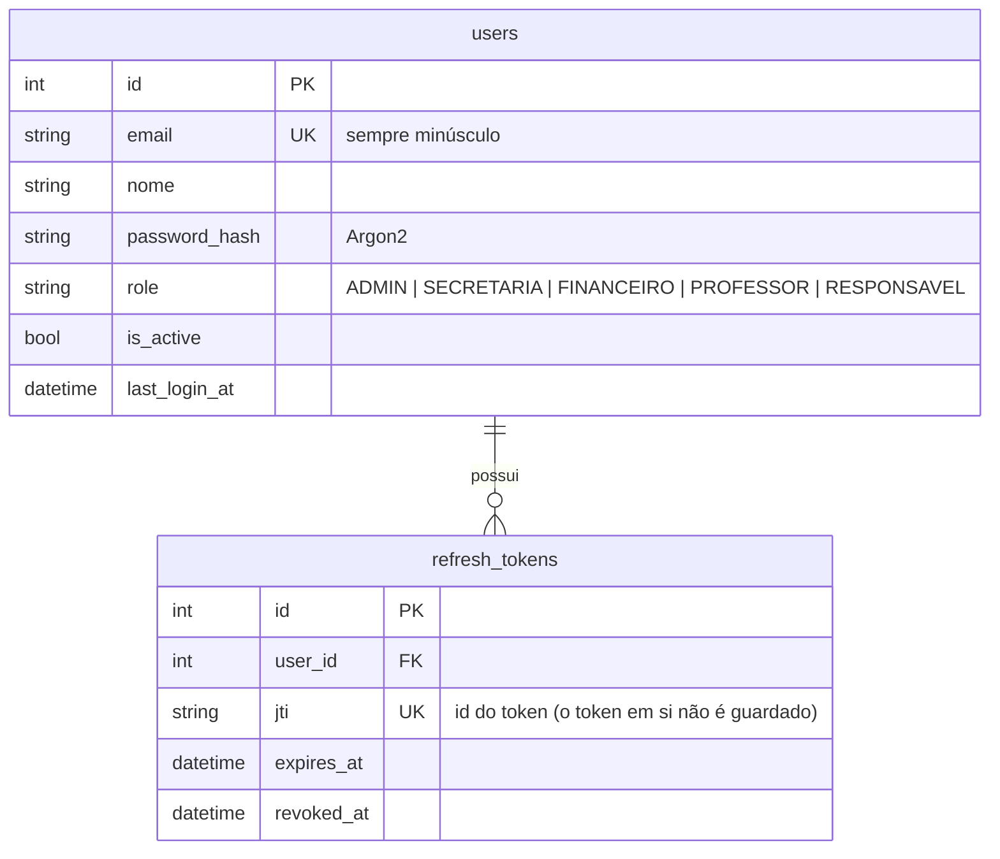

# Módulo `auth`

## Objetivo

Contas de acesso, login, renovação de sessão (refresh token), logout, troca de senha e
gestão de usuários pelo ADMIN. É o único módulo sem dependência de outros módulos.

## Entidades



As pessoas (responsável, professor, funcionário) ficam no módulo `pessoas` e apontam para
`users.id` quando têm login.

## Endpoints

| Método | Rota | Perfis | Descrição |
|---|---|---|---|
| POST | `/api/v1/auth/login` | público (rate limit por IP) | Devolve access token + refresh token (corpo e cookie httpOnly) |
| POST | `/api/v1/auth/refresh` | público (com refresh token) | Rotaciona o refresh token e emite novo access token |
| POST | `/api/v1/auth/logout` | público | Revoga o refresh token e apaga o cookie |
| GET | `/api/v1/auth/me` | qualquer autenticado | Dados do usuário logado |
| POST | `/api/v1/auth/me/senha` | qualquer autenticado | Troca a própria senha (revoga as outras sessões) |
| GET | `/api/v1/auth/users` | ADMIN | Lista usuários (filtro `role`) |
| POST | `/api/v1/auth/users` | ADMIN | Cria usuário de qualquer perfil |
| PATCH | `/api/v1/auth/users/{user_id}` | ADMIN | Altera nome, perfil ou desativa |

## Regras de negócio e segurança

- **Senha**: mínimo 8 caracteres, com letras e números; hash Argon2.
- **Login**: e-mail inexistente e senha errada devolvem a **mesma** mensagem e gastam o mesmo
  tempo (evita descobrir quais e-mails existem). Usuário inativo não entra.
- **Access token**: JWT HS256, 15 minutos, com `sub`, `role`, `email`, `type=access`.
  Tokens com `alg=none`, assinados com outra chave ou do tipo errado são rejeitados.
- **Refresh token**: 7 dias, guardado pelo `jti`. Cada uso **rotaciona** o token. Se um token
  já revogado for reapresentado (sinal de vazamento), **todas** as sessões do usuário caem
  (`TOKEN_REUSED`).
- **Cookie** `semeando_refresh`: `HttpOnly`, `SameSite=Strict`, `Path=/api/v1/auth`,
  `Secure` em produção (`REFRESH_COOKIE_SECURE=true`).
- **Desativar usuário** ou **trocar senha** revoga os refresh tokens. O access token atual
  expira em no máximo 15 minutos.
- O ADMIN não pode desativar nem trocar o perfil da própria conta (evita ficar sem admin).
- O `role` só é aceito na criação feita pelo ADMIN. No cadastro público (módulo `pessoas`) o
  perfil é sempre `RESPONSAVEL`.

## API pública para outros módulos

- `create_user_account(db, email=, nome=, password=, role=) -> UserRead` (sem commit)
- `get_user_read(db, user_id) -> UserRead | None`

## Como testar

```bash
cd backend
uv run pytest tests/modules/auth -v
```

Casos cobertos: login feliz e com erro (mensagem genérica), rate limit (429), rotação e reuso
de refresh token, logout idempotente, troca de senha, gestão de usuários só por ADMIN (403
para os demais perfis) e rejeição de campos desconhecidos (422).
