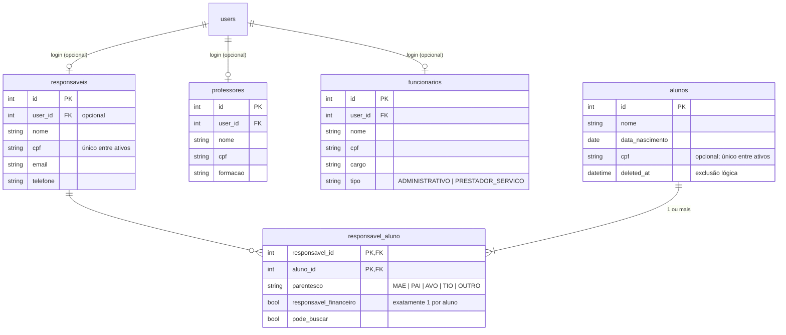

# Módulo `pessoas`

## Objetivo

Cadastro de **alunos**, **responsáveis** (com vínculo N:N aos alunos), **professores** e
**funcionários** (administrativos e prestadores de serviço). Também concentra a regra de
**propriedade de dados**: quem é responsável por qual aluno.

## Entidades



## Endpoints (`/api/v1/pessoas`)

| Método | Rota | Perfis | Descrição |
|---|---|---|---|
| GET | `/alunos?busca=` | ADMIN, SECRETARIA, FINANCEIRO | Lista alunos (CPF **mascarado**) |
| POST | `/alunos` | ADMIN, SECRETARIA | Cria aluno com seus vínculos |
| GET | `/alunos/{aluno_id}` | equipe; RESPONSAVEL **só do próprio filho** | Detalhe com responsáveis |
| PATCH | `/alunos/{aluno_id}` | ADMIN, SECRETARIA | Altera dados |
| DELETE | `/alunos/{aluno_id}` | ADMIN | Exclusão lógica |
| POST | `/alunos/{aluno_id}/responsaveis` | ADMIN, SECRETARIA | Vincula responsável |
| PATCH | `/alunos/{aluno_id}/responsaveis/{responsavel_id}` | ADMIN, SECRETARIA | Altera parentesco/pode_buscar ou torna financeiro |
| DELETE | `/alunos/{aluno_id}/responsaveis/{responsavel_id}` | ADMIN, SECRETARIA | Remove vínculo |
| POST | `/responsaveis/registro` | **público** (rate limit) | Cadastro de responsável com login |
| GET | `/responsaveis?busca=` | ADMIN, SECRETARIA, FINANCEIRO | Lista (CPF mascarado) |
| POST | `/responsaveis` | ADMIN, SECRETARIA | Cria (opcionalmente com acesso) |
| GET/PATCH | `/responsaveis/{id}` | leitura: equipe; edição: ADMIN, SECRETARIA | Detalhe / edição |
| POST | `/responsaveis/{id}/acesso` | ADMIN, SECRETARIA | Cria o login de um responsável já cadastrado |
| GET/POST | `/professores` | ADMIN, SECRETARIA | Lista / cria (opcionalmente com acesso PROFESSOR) |
| GET/PATCH/DELETE | `/professores/{id}` | ADMIN, SECRETARIA | Detalhe / edição / exclusão lógica |
| GET/POST | `/funcionarios` | ADMIN | Lista / cria (acesso com perfil ADMIN, SECRETARIA ou FINANCEIRO) |
| GET/PATCH/DELETE | `/funcionarios/{id}` | ADMIN | Detalhe / edição / exclusão lógica |

## Regras de negócio

1. **Todo aluno tem pelo menos 1 responsável e exatamente 1 responsável financeiro.**
   - Na criação, o schema exige exatamente um `responsavel_financeiro: true`.
   - Tornar outro responsável financeiro tira o papel do anterior (índice único parcial no
     banco garante que nunca existam dois).
   - Não é possível remover o último responsável (`ALUNO_SEM_RESPONSAVEL`) nem o financeiro
     sem antes transferir (`TRANSFERIR_FINANCEIRO`).
2. **Propriedade (anti-IDOR)**: `ensure_can_access_aluno(db, user, aluno_id)`
   - equipe (ADMIN, SECRETARIA, FINANCEIRO): qualquer aluno;
   - RESPONSAVEL: só alunos vinculados. Para os demais devolve **404** (não revela a existência);
   - outros perfis: **403**.
3. **Cadastro público** sempre cria perfil `RESPONSAVEL`. Se o CPF já existe, o cadastro é
   **recusado** (`CPF_JA_CADASTRADO`). Assumir o registro existente permitiria que qualquer
   pessoa que soubesse um CPF ganhasse acesso aos filhos de outra família. A secretaria libera
   o acesso pelo endpoint `/responsaveis/{id}/acesso`.
4. **CPF**: validado pelos dígitos verificadores, guardado só com números, único entre registros
   ativos e **mascarado** (`***.456.789-**`) em todas as listagens (LGPD).
5. **Exclusão lógica** (`deleted_at`): o histórico (matrículas, cobranças) é preservado, e o CPF
   volta a ficar disponível.

## API pública para outros módulos (sem commit)

`ensure_can_access_aluno`, `list_aluno_ids_do_usuario`, `get_aluno_read`, `list_alunos_reads`,
`find_aluno_by_cpf`, `create_aluno_record`, `update_aluno_record`, `soft_delete_aluno_record`,
`link_responsavel_record`, `get_responsavel_financeiro`, `is_responsavel_do_aluno`,
`get_responsavel_by_user`, `find_responsavel_by_cpf`, `list_responsaveis_reads`,
`create_responsavel_record`, `upsert_responsavel_record` (só para a equipe),
`get_professor_by_user`, `list_professores_reads`.

## Como testar

```bash
cd backend
uv run pytest tests/modules/pessoas -v
```

Casos de segurança cobertos: responsável acessando filho de outra família (404), professor
acessando aluno (403), cadastro público com `role`/`user_id` no corpo (422), cadastro com CPF
existente (409), CPF mascarado nas listagens e rate limit do cadastro (429).
